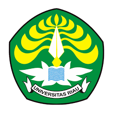

  

<h1 align="center">SIKAP FKp UNRI</h1>
<h3 align="center">Sistem Informasi Kepegawaian & Kinerja Pegawai</h3>

<strong>Fakultas Keperawatan — Universitas Riau</strong>

  
  
  

---

## 📌 Tentang SIKAP FKp UNRI
**SIKAP** (Sistem Informasi Kepegawaian & Kinerja Pegawai) adalah aplikasi manajemen SDM terpadu di lingkungan **Fakultas Keperawatan Universitas Riau**. Sistem ini dirancang untuk mendigitalkan seluruh administrasi kepegawaian bagi Dosen dan Tenaga Kependidikan (Tendik).

### 🚀 Fitur Unggulan
- **Pemberkasan Pegawai Lengkap**: Profil biodata, riwayat kepangkatan/golongan, jabatan struktural/fungsional, pendidikan, sertifikasi STR/SIP, SKP tahunan, hingga tugas belajar.
- **Pengajuan Cuti Berjenjang Hierarkis**: Alur verifikasi pengajuan cuti berjenjang sesuai struktur organisasi (Atasan Langsung: Kaprodi/Kajur/Pokja $\rightarrow$ Pejabat Berwenang Menyetujui: Dekan / Wadek).
- **Tata Naskah Dinas Resmi**: Format cetak Formulir Cuti, SK KGB, dan Lembar Profil sesuai regulasi **Permendiktisaintek No. 42 Tahun 2025**.
- **Tanda Tangan Elektronik & Verifikasi Publik**: Dilengkapi QR Code dan kode hash verifikasi keaslian dokumen publik.
- **Dashboard Monitoring & Analytics**: Rekapitulasi kelengkapan data pegawai (100% Lengkap, Cukup Lengkap, Perlu Dilengkapi) yang dapat difilter secara interaktif.

---

## 👨‍💻 Inisiator & Tim Pengembang
Sistem ini diinisiasi, dirancang, dan dikembangkan oleh:
* **Pengembang Sistem**: **Rahmad Hidayat Majlan, S.T.** `(RHM)`
* **Instansi**: Fakultas Keperawatan, Universitas Riau

Untuk informasi lisensi dan hak kepemilikan inovasi, silakan rujuk berkas [AUTHORS.md](AUTHORS.md).

---

## 🐳 Panduan Deployment
Aplikasi telah dilengkapi kontainerisasi Docker multi-stage (PHP 8.3 FPM + Nginx + MySQL 8.0).  
Silakan baca panduan lengkap pada [DOCKER_DEPLOY_GUIDE_TIK_UNRI.md](DOCKER_DEPLOY_GUIDE_TIK_UNRI.md).

---

  &copy; 2026 <strong>SIKAP FKp UNRI</strong>. Dikembangkan oleh <strong>Rahmad Hidayat Majlan, S.T. (RHM)</strong> untuk Fakultas Keperawatan Universitas Riau.

