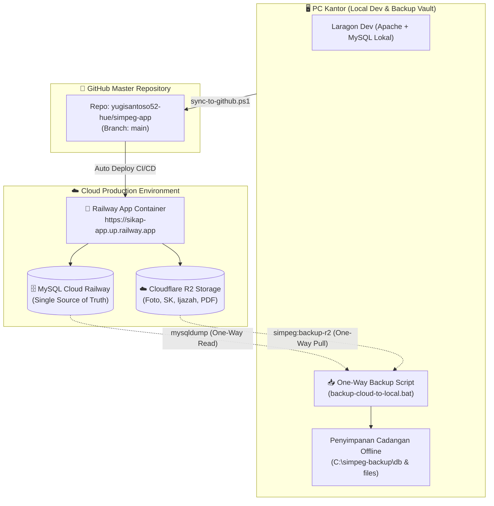

# 📋 Standar Operasional Prosedur (SOP) & Panduan Arsitektur
## SIKAP (Sistem Informasi Kepegawaian) - Fakultas Keperawatan Universitas Riau
### Arsitektur Struktur 2: Cloud-as-Primary + Cloudflare R2 + One-Way Local Backup

Dokumen ini adalah panduan kerja resmi bagi administrator sistem dalam mengoperasikan, mengembangkan, mencadangkan data, dan memelihara aplikasi **SIKAP FKP UNRI**.

---

## 1. Diagram Alur Kerja & Arsitektur Sistem

```
[ 💻 PC Kantor / Local Dev ]
  │
  ├─► Coding / Testing (Laragon Lokal)
  │      │
  │      ▼ (Push Git: sync-to-github.ps1)
  │   [ 🐙 GitHub Repo ]
  │      │
  │      ▼ (Auto Deploy CI/CD)
  │   [ ☁️ Cloud Railway ] ── (Production App: sikap-app.up.railway.app)
  │          │
  │          ├─► Database Utama ──► [ MySQL Cloud Railway ]
  │          │
  │          └─► File SK / PDF / Ijazah ──► [ ☁️ Cloudflare R2 (S3-Compatible) ]
  │                                                   ▲
  └─► [ 📥 Backup Script (One-Way Pull) ]             │
         ├─► Download SQL Dump dari Railway ──────────┤ (Hanya membaca / backup)
         └─► Download file arsip dari R2 ke Harddisk PC
```



---

## 2. Keunggulan Arsitektur Baru

1. **Single Source of Truth (Satu Sumber Kebenaran)**:
   Data kepegawaian tidak lagi bercabang. Database utama berada di Cloud Railway, sehingga tidak ada risiko tubrukan / konflik data (*data overwrite*).
2. **Keamanan Berkas Terjamin di Cloudflare R2**:
   Berkas SK, KGB, Ijazah, dan Foto tersimpan di Cloudflare R2 yang memiliki redundansi tinggi, bebas biaya bandwidth unduhan (*zero egress fee*), dan gratis 10 GB pertama per bulan.
3. **Pencadangan Satu Arah (One-Way Pull) yang Aman**:
   PC kantor bertindak sebagai *Backup Vault* offline. Script hanya membaca dan mengunduh cadangan dari cloud ke PC, tidak pernah menimpa balik ke cloud.
4. **Fleksibilitas Kerja**:
   Pegawai dan pimpinan dapat mengakses aplikasi dari mana saja secara resmi melalui tautan online tanpa bergantung pada PC kantor yang harus menyala 24 jam.

---

## 3. Alur Kerja Harian (Daily Routine SOP)

### 💻 A. Pengembangan Fitur / Kodingan Baru di PC
1. Buka project di `C:\laragon\www\simpeg`.
2. Nyalakan Laragon jika ingin menguji fitur di localhost (`http://sikap.fkpunri.test`).
3. Setelah selesai mengubah kode atau tampilan:
   * Klik kanan **`sync-to-github.ps1`** ➔ Pilih **"Run with PowerShell"**.
   * Masukkan pesan commit atau tekan **Enter**.
   * Kode otomatis ter-push ke GitHub.
   * **Railway akan otomatis mendeteksi dan memperbarui website cloud dalam 2–3 menit**.

---

### 📥 B. Menjalankan Backup Data Cloud ke PC Kantor (Manual / Sewaktu-waktu)
Kapan pun Anda ingin memastikan data cloud sudah tersimpan salinannya di harddisk PC kantor:

1. Buka folder:
   ```text
   C:\laragon\www\simpeg\scripts
   ```
2. **Double-click** file:
   ```text
   backup-cloud-to-local.bat
   ```
3. Sistem akan otomatis:
   * Mengunduh dump database Railway MySQL dan mengompresnya menjadi file `.sql.gz`.
   * Mengunduh berkas baru dari Cloudflare R2 ke `C:\simpeg-backup\files`.
   * Membersihkan cadangan database yang berusia lebih dari 30 hari.
   * Menyimpan log riwayat di `C:\simpeg-backup\logs\backup.log`.

---

### ⏰ C. Backup Otomatis Harian (Windows Task Scheduler)
Agar pencadangan berjalan otomatis tanpa perlu diklik setiap hari:

1. Klik kanan **PowerShell** ➔ Pilih **"Run as Administrator"**.
2. Jalankan perintah:
   ```powershell
   & "C:\laragon\www\simpeg\scripts\setup-taskscheduler.ps1"
   ```
3. Task `SikapBackupCloudToLocal` akan terdaftar dan berjalan otomatis **setiap malam pukul 02:00 WIB**.

---

## 4. Panduan Konfigurasi Cloudflare R2 & Railway

### ☁️ A. Pengaturan Cloudflare R2
1. Login ke [Cloudflare Dashboard](https://dash.cloudflare.com/) ➔ Pilih menu **R2**.
2. Klik **Create bucket** ➔ Beri nama bucket: `sikap-files` (atau nama pilihan Anda).
3. Di tab **Settings** bucket:
   * Pada bagian **Public Access**, Anda bisa mengaktifkan *Custom Domain* (misal: `files.sikap.fkpunri.ac.id`) atau mengaktifkan *R2.dev subdomain*.
4. Di halaman utama R2, klik **Manage R2 API Tokens** di sisi kanan ➔ Klik **Create API token**:
   * Permissions: **Object Read & Write**
   * TTL: Forever (atau sesuai kebutuhan)
5. Simpan:
   * **Access Key ID**
   * **Secret Access Key**
   * **Endpoint URL** (format: `https://<account_id>.r2.cloudflarestorage.com`)

---

### 🚀 B. Pengaturan Variabel Lingkungan di Dashboard Railway
Buka project Anda di [Railway](https://railway.app/) ➔ Pilih service aplikasi Anda ➔ Buka tab **Variables** ➔ Tambahkan:

```ini
APP_NAME="SIKAP FKP UNRI"
APP_ENV=production
APP_DEBUG=false
APP_URL=https://sikap-app.up.railway.app

# Konfigurasi Storage R2
FILESYSTEM_DISK=r2
R2_ACCESS_KEY_ID=isi_dengan_access_key_id_cloudflare
R2_SECRET_ACCESS_KEY=isi_dengan_secret_access_key_cloudflare
R2_DEFAULT_REGION=auto
R2_BUCKET=sikap-files
R2_ENDPOINT=https://<account_id>.r2.cloudflarestorage.com
R2_URL=https://pub-xxxxxx.r2.dev

# Database Railway (Otomatis disediakan jika menambahkan plugin MySQL Railway)
DB_CONNECTION=mysql
DB_HOST=${{MySQL.MYSQLHOST}}
DB_PORT=${{MySQL.MYSQLPORT}}
DB_DATABASE=${{MySQL.MYSQLDATABASE}}
DB_USERNAME=${{MySQL.MYSQLUSER}}
DB_PASSWORD=${{MySQL.MYSQLPASSWORD}}
```

---

### 🖥️ C. Pengaturan Variabel Remote Backup di `.env` PC Kantor
Agar script `backup-cloud-to-local.bat` di PC kantor dapat menarik database langsung dari Railway, buka `C:\laragon\www\simpeg\.env` di PC kantor dan isi:

```ini
# Ambil dari menu 'Connect' -> 'TCP Proxy' / External Connection di Railway MySQL Service
RAILWAY_MYSQL_HOST=autorack.proxy.rlwy.net   # (contoh host eksternal railway)
RAILWAY_MYSQL_PORT=xxxxx                    # (port publik railway)
RAILWAY_MYSQL_DATABASE=railway
RAILWAY_MYSQL_USER=root
RAILWAY_MYSQL_PASSWORD=password_railway_anda

# Kredensial R2 untuk menarik file arsip
R2_ACCESS_KEY_ID=isi_dengan_access_key_id
R2_SECRET_ACCESS_KEY=isi_dengan_secret_access_key
R2_BUCKET=sikap-files
R2_ENDPOINT=https://<account_id>.r2.cloudflarestorage.com
```

---

## 5. Daftar Script & Alat Bantu

| File Script | Lokasi | Fungsi |
|---|---|---|
| ⚡ **`sync-to-github.ps1`** | `C:\laragon\www\simpeg\` | Unggah kodingan ke GitHub & trigger auto CI/CD build Railway |
| 📥 **`backup-cloud-to-local.bat`** | `scripts\` | Pencadangan 1-klik (Unduh DB Railway + Berkas R2 ke harddisk PC) |
| ⏰ **`setup-taskscheduler.ps1`** | `scripts\` | Mendaftarkan jadwal otomatis backup tiap pukul 02:00 WIB di Windows |
| 🚀 **`start-server.bat`** | `scripts\` | Menyalakan Apache & MySQL lokal jika ingin development di PC |
| 🌐 **`ganti-domain-ke-sikap.bat`** | `scripts\` | Mendaftarkan nama domain dev `sikap.fkpunri.test` di Windows hosts |
