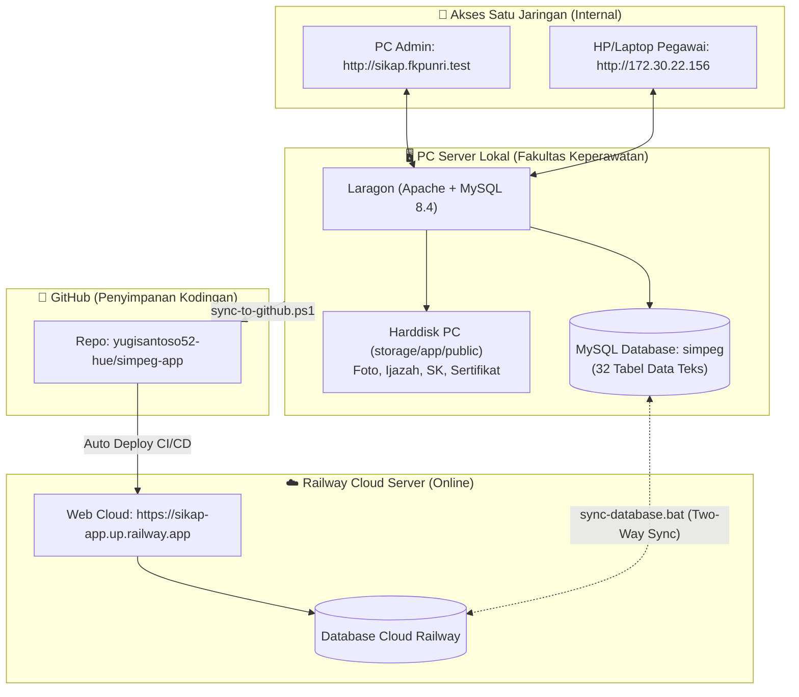

# 📋 Standar Operasional Prosedur (SOP) & Ringkasan Alur Kerja
## SIKAP (Sistem Informasi Kepegawaian) - Fakultas Keperawatan Universitas Riau

Dokumen ini adalah panduan kerja resmi bagi administrator sistem dalam mengoperasikan, mengembangkan, menyinkronkan data, dan memelihara aplikasi **SIKAP FKP UNRI**.

---

## 1. Arsitektur Sistem Menyeluruh

Aplikasi ini menggunakan arsitektur **Hybrid (Offline-First & Cloud)**:



---

## 2. Alur Kerja Harian (Daily Routine SOP)

### 🌅 A. Saat Menyalakan PC di Pagi Hari
1. Nyalakan PC kantor.
2. Buka aplikasi **Laragon**.
3. Pastikan tombol **"Start All"** sudah diklik (indikator Apache dan MySQL aktif).
4. *(Opsional)* Jika Laragon sempat gagal start karena tabrakan port, cukup double-click:
   ```text
   C:\laragon\www\simpeg\scripts\start-server.bat
   ```
5. Buka browser dan buka:
   ```text
   http://sikap.fkpunri.test
   ```
   Aplikasi siap digunakan untuk melayani administrasi kepegawaian.

---

### 👥 B. Melayani Pegawai yang Mengakses via HP / Laptop Kantor (Satu WiFi)
* Pastikan HP/Laptop pegawai tersambung ke WiFi yang sama dengan PC server (**SSO TIK UNRI**).
* Berikan alamat IP berikut kepada pegawai:
  ```text
  http://172.30.22.156
  ```
* Pegawai dapat langsung login menggunakan NIP dan password masing-masing untuk mengajukan cuti, memperbarui data, atau melihat riwayat SK.

---

### 🔄 C. Menyinkronkan Data antara PC Kantor dan Cloud Railway
Jika Anda telah selesai menginput data baru di PC kantor (atau ada pegawai yang menginput data dari luar kampus lewat link Railway), lakukan sinkronisasi data agar kedua database tetap sama:

1. Buka folder:
   ```text
   C:\laragon\www\simpeg\scripts
   ```
2. **Double-click** file:
   ```text
   sync-database.bat
   ```
3. Sistem akan otomatis:
   * Mengirim (*Push*) data pegawai baru dari PC ke Railway.
   * Menarik (*Pull*) pembaruan dari Railway ke PC.
   * Muncul pesan `TWO-WAY SYNC COMPLETED SUCCESSFULLY`.

---

### 💻 D. Saat Ada Perubahan Kodingan / Tampilan Web
Jika Anda selesai mengubah kodingan, merapikan tampilan, atau menambah fitur baru:

1. Buka folder utama project:
   ```text
   C:\laragon\www\simpeg
   ```
2. Klik kanan file **`sync-to-github.ps1`** ➔ Pilih **"Run with PowerShell"**.
3. Ketik pesan perubahan (misal: `perbaikan tampilan`) atau tekan **Enter**.
4. Script akan otomatis mengunggah kodingan ke GitHub.
5. **Server Railway Cloud otomatis mendeteksi dan meng-update website online dalam 2-3 menit**.

---

## 3. Matriks Tautan & Kebutuhan Akses

| Kebutuhan | Alamat / Link yang Digunakan | Syarat Akses |
|---|---|---|
| **Akses Utama Admin di PC** | `http://sikap.fkpunri.test` | Buka di PC Server kantor |
| **Cadangan Admin di PC** | `http://simpeg.test` | Buka di PC Server kantor |
| **Akses Pegawai di Lingkungan Kampus** | `http://172.30.22.156` | Terhubung ke WiFi yang sama dengan PC Server |
| **Akses Online dari Luar Kampus (Internet Umum)** | `https://sikap-app.up.railway.app` | Di mana saja dengan kuota/internet apa saja |
| **Kelola Database MySQL Lokal** | `http://localhost/phpmyadmin` | Buka di PC Server (DB: `simpeg`) |
| **Penyimpanan Kodingan Master** | `https://github.com/yugisantoso52-hue/simpeg-app` | Akun GitHub |

---

## 4. Daftar File Penting & Alat Bantu (Shortcut Tools)

Semua kebutuhan administrasi telah dibuatkan jalan pintas 1-klik di folder project:

| File Script | Lokasi | Fungsi |
|---|---|---|
| ⚡ **`sync-to-github.ps1`** | `C:\laragon\www\simpeg\` | Backup kodingan ke GitHub & trigger auto-deploy Railway |
| 🔄 **`sync-database.bat`** | `C:\laragon\www\simpeg\scripts\` | Sinkronisasi data dua arah antara PC Lokal dan Cloud Railway |
| 🚀 **`start-server.bat`** | `C:\laragon\www\simpeg\scripts\` | Menyalakan Apache & MySQL lokal dengan 1-klik jika terjadi kendala |
| 🛡️ **`buka-firewall-port80.bat`** | `C:\laragon\www\simpeg\scripts\` | Memastikan port 80 terbuka untuk akses WiFi multi-perangkat |
| 🌐 **`ganti-domain-ke-sikap.bat`** | `C:\laragon\www\simpeg\scripts\` | Mendaftarkan nama domain `sikap.fkpunri` di Windows |

---

## 5. Panduan Singkat Penanganan Kendala (Troubleshooting)

### ❓ Kendala 1: Database Error (`Connection actively refused`)
* **Penyebab**: Service MySQL Laragon belum menyala.
* **Solusi**: Buka Laragon dan klik **Start All**, atau jalankan file `scripts\start-server.bat`.

### ❓ Kendala 2: HP tidak bisa membuka `172.30.22.156`
* **Penyebab**: HP tidak tersambung ke WiFi kantor (menggunakan paket data seluler) atau IP WiFi PC berubah.
* **Solusi**:
  1. Pastikan WiFi di HP menyala dan terhubung ke **SSO TIK UNRI**.
  2. Jika pegawai berada di rumah / luar kantor, arahkan mereka membuka link Cloud: `https://sikap-app.up.railway.app`.

### ❓ Kendala 3: Perubahan kodingan belum tampak di Cloud Railway
* **Penyebab**: Railway membutuhkan waktu 2-4 menit untuk proses build container Docker.
* **Solusi**: Cek tab **Deployments** di dashboard Railway untuk memastikan status build sudah hijau (*Active / Deployment successful*), lalu tekan **Ctrl + F5** di browser.
